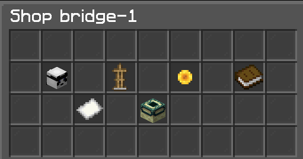
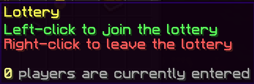
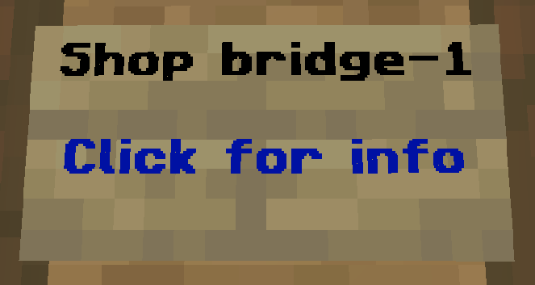

# RentableRegions
A flexible market/cells/player housing Spigot plugin

### Features
- Create custom regions that players can rent
- Each region has one owner and supports up to 10 members
- Customizable regions allow each one to be unique
- Use one or multiple WorldGuard regions per "shop" (cuboid and polygon supported) to define the bounds
- Easy to use GUI which handles renting and lotteries and displays all relevant information
- Intelligent command tab-completion
- All 80+ messages are configurable

### Requirements
- There are a few required dependencies: [ServerUtils](https://www.spigotmc.org/resources/serverutils.106515/), [Vault](https://www.spigotmc.org/resources/vault.34315/), [WorldEdit](https://dev.bukkit.org/projects/worldedit) or [FAWE](https://www.spigotmc.org/resources/fastasyncworldedit.13932/), [WorldGuard](https://dev.bukkit.org/projects/worldguard)
- And my private plugins PlayerLevels and RankUps (currently unavailable)
  - Only used for claiming permission (can easily be removed)

### Setup
- In the plugin's config.yml, you need to change the `world:` to the world you will put all of your shops in.
  - After setting the world, you can run `/rr reload` to apply the changes

*From now on I will use "shop" and "region" interchangeably. They are the same thing*

### Player Commands
- The base command is `market` (alias `cell`) with the permission `rentableregions.player`
- All commands require permission to use which follows the format `rentableregions.player.command` where command is the name of the command
- Note: arguments with <> are required and [] are optional
- `/market help [page]` Opens the help menu
- `/market home` Teleport to your shop
- `/market invite <player>` Invite a player to your shop
- `/market join` Accept an invitation
- `/market kick <player>` Kick a member from your shop
- `/market leave` Leave your shop
- `/market menu <id>` Open a shop's menu
- `/market privacy` Toggle your shop's privacy
- `/market promote <player>` Promote a member from your shop to owner
- `/market trade <owner> <arg> <money>` Create a trade request
- `/market unInvite` Cancel a pending invite
- `/market unclaim` Unclaim your shop
- `/market visit <player>` Visit a player's shop
- `/market visitID <id>` Visit a shop by its ID

### Admin Commands
- The base command is `rr` (alias `rentableregions`) with the permission `rentableregions.admin`
- All commands require permission to use which follows the format `rentableregions.admin.command` where command is the name of the command
- `/rr clone <id> <region>` Create a new shop and copy properties from another
- `/rr create <id> [region]` Create a new shop
- `/rr copyProperties <fromID> <toID>` Copies a shop's properties to another shop
- `/rr delete <id>` Delete a shop
- `/rr dump <arg>` Collect plugin information
- `/rr help [page]` Opens the help menu
- `/rr info <id>` Print shop information to your chat
- `/rr member <id> <add|clear|remove> [player]` Edit a shop's members
- `/rr region <id> <add|remove> <region>` Edit a shop's regions
- `/rr reload [arg]` Reloads this plugin or a specified portion
- `/rr set <id> <field> <value>` Edit miscellaneous shop properties
- `/rr sign <id> <delete|set>` Set or delete a shop's linked sign
- `/rr toggleTimer` Toggles the shop timer on/off
- `/rr transfer <id> <toPlayer> [time]` Transfer shop ownership and set the rent time remaining
- `/rr updateSigns` Reloads the text on all shop signs
- `/rr validateRegionParents` Checks if all shop regions inherit from a parent region
- `/rr validateRegions [update]` Checks all shop regions for owner and member mismatches
- `/rr visitLocation <id> <exact|snap> [x] [y] [z] [pitch] [yaw]` Edit a shop's visit location

### Shop Menu
- Each shop has its own inventory which displays information about the following
  - `Owner item`: Display the owner's skull
    - Placeholders: `{name}`
  - `Member item:` Display a list of members or a special message when empty
    - Placeholders: `[lore]` It will display one member per line and will delete any other text on the line with the placeholder.
  - `Rent item:` Display information about renting
    - Placeholders: `{time_remaining} {time_increase} {rent_charge} {rent_time} {max_time}`
  - `Extra item:` Display the required PlayerLevels level and member capacity
    - Placeholders: `{level_required} {member_cap}`
  - `Lottery item:` Display information about the lottery when active
    - Placeholders: `{entries}`
  - `Teleport item:` Teleport to the shop when clicked

### Trading - CURRENTLY BROKEN - DISABLE THIS COMMAND
- A common issue is moving shops between players, so a trading system has been put in place
- There were 3 types of trades that players can create (they are named from the perspective of the creator of the trade)
  - `Buy Trade` The creator pays the recipient for their shop
  - `Sell Trade` The creator sells their shop to the recipient (creator requests money)
  - `Swap Trade - give` The creator pays the recipient and the shops get swapped
  - `Swap Trade - request` The creator requests money from the recipient and the shops get swapped
- Trading a shop will cause all members to be removed

### Lottery
- A lottery takes away the "luck" from obtaining a newly expired shop
- A lottery will begin when a shop has below 10 minutes of rent time remaining
- When the lottery ends, one player is chosen randomly to become the new owner
- If the shop is rented during a lottery, all participants will get their money back
- Players are free to leave the lottery at any time and get their money back

### Shop Signs
- A shop can have a sign placed down that will open its menu when clicked
- To link a sign to its shop, use `/rr sign <id> set` to link the sign
- To delete a sign, you can break it or use `/rr sign <id> delete`
- Using the command `/rr updateSigns` will force update the text of **all** shop signs
- The sign's text, glow, and glow color can be changed in the plugin's config.yml
  - Sign placeholders: `{id}`

### Notes
- All data is saved in the file `shops.yml`. Incorrectly editing this file will cause it to delete. You have been warned!
- The plugin saves shop changes (members, regions, settings) once per second if any values have changed
- All shops also auto-save every 5 minutes to store the time remaining and any other changes
- Regions can have up to 10 members (set to 1 by default)
- A lottery will begin with 10 minutes of rent time remaining. This value is currently not configurable

### Tutorial
- This tutorial will give you a step-by-step process to make a shop
- It will also tell you how to easily copy shop settings by using the `clone` command

#### Creating your first shop
1. To make a shop you will need to make a region. Make a cuboid or polygon region through WorldGuard, let's call it `shop-1a`
2. Create your shop with `/rr create <id> [region]` where id is the name of the shop and region is the name of the region you just created. Let's call this shop `shop-1`. My command would be `/rr create shop-1 shop-1a`
3. Now that you have your shop, let's set up the sign. Place down a sign, look at it, then use `/rr sign shop-1 set`. If it worked, the text on the sign will change.
4. Now let's set the visit location. Stand on the block you want and look in the general direction you want the player to face, then use `/rr visitLocation shop-1 snap`. This will center your position on the block, and make the head location snap to a cardinal direction
5. How about we change the default settings to something different. I will change all settings for my shop:
   - `/rr set shop-1 capacity 2` This will set the member capacity to 2 (1 by default)
   - `/rr set shop-1 level 20` This will set the minimum player level to 20 (this applies to the owner and members)
   - `/rr set shop-1 maxRentTime 259200` This will set the max rent time to 3 days (259200 seconds)
   - `/rr set shop-1 rentPrice 2500` This will set the rent price to $2500
   - `/rr set shop-1 timePerRent 43200` This will set the time per rent to 12 hours per $2500
#### Cloning your shop
1. Make another region for this shop, let's call it `shop-2a`
2. Use `/rr clone <id> <newID> <region>` where my command is `/rr clone shop-1 shop-2 shop-2a`
   - Cloning a shop copies all the settings we changed earlier and our first shop's region priority
3. After setting the sign and visit location, this shop is ready to go!

#### Adding more regions to a shop
1. Make a new region, let's call it `shop-1b`
2. To make it a region for `shop-1`, use the command `/rr region <id> add <region>` where my command is `/rr region shop-1 add shop-1b`
3. To add more regions, just repeat steps 1 and 2

#### Importance of naming conventions
- Even in this tutorial, you may have gotten confused why I chose the names that I did. Why use `shop-1` and `shop-1a`?
- If you have a lot of shops on your server, it will get messy with all the shop ids and regions
- I suggest using a naming pattern like the following:
  - Name your shops something with numbers and count up as you make more. If you have distinct shop areas, consider using names like `cell-1` and `town-1`
  - Name your regions so you know what region belongs to a shop by its name. For example, if `cell-13` has 3 regions, consider naming them `cell-13a` `cell-13b` and `cell-13c`

#### Template regions
- Refrain from adding flags to *every* individual shop region. Instead, you should use a template region to handle all fo the flags and set it as the parent of every shop region
- If you have multiple areas and need different flags for each, make templates for each group of shops
- The plugin edits the ENTRY flag for setting shop privacy, so you can ignore this flag
- Check out this page on [priority and inheritance](https://worldguard.enginehub.org/en/latest/regions/priorities/?highlight=template#priority-and-inheritance)